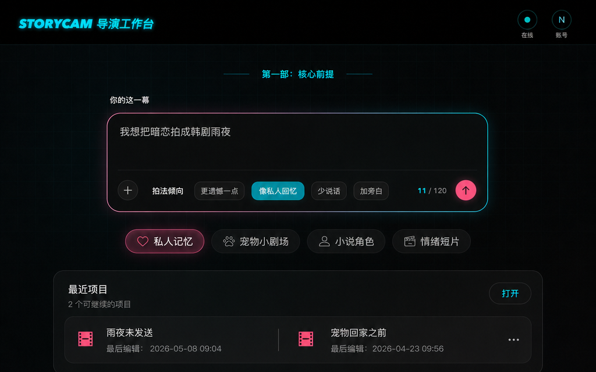
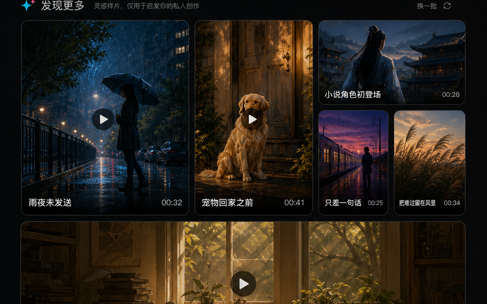

# StoryCam

[English](README.md) | [简体中文](README.zh-CN.md)

[](https://github.com/nlp-zn/storycam/actions/workflows/ci.yml)
[](LICENSE)
[](https://nextjs.org/)
[](https://www.typescriptlang.org/)
[](https://supabase.com/)

[](https://storycam.znbuild.com)
[](https://space.bilibili.com/511795462)
[](https://portfolio.znbuild.com/tutorial/storycam/index.html)
[](docs/README.md)

StoryCam is a web-first AI private story theater: it turns a personal idea and optional photos into a confirmed story world, a storyboard, a generated clip, and an account-scoped final work preview.

It is not an industrial short-drama backend. The product is built for ordinary users who want to make a small story feel like their own memory, while the system keeps professional directing logic, prompt packets, provider payloads, signed URLs, and model parameters behind server-side boundaries.

**Tags:** `ai-video` `storytelling` `agentic-full-stack` `nextjs` `supabase` `storyboard`

| Story Input | Discovery Samples |
| --- | --- |
|  |  |

## Learning Materials

StoryCam is also a documented agentic full-stack build case study. The public learning material is intentionally separate from the product UI:

- `docs/learning/index.md` maps the product, engineering, launch, and growth lessons.
- `docs/learning/bilibili-series.md` links the Chinese Bilibili build series from product design through deployment and launch assets.
- `docs/learning/portfolio-course.md` links the long-form StoryCam course chapters hosted on the portfolio site.

Useful external entry points:

- [StoryCam Bilibili build series](https://space.bilibili.com/511795462)
- [StoryCam course index](https://portfolio.znbuild.com/tutorial/storycam/index.html)

### Bilibili Series


_Representative cover from episode 10._

| Episode | Title | Focus |
| --- | --- | --- |
| 01 | Do Not Start With Code: I Used an AI Agent for Product Design | Product positioning, private story-theater direction, and defining the problem before implementation. |
| 02 | Do Not Rush Into a PRD: I Used an AI Agent to Understand the Design | Design interpretation, product context extraction, and UI-to-spec handoff. |
| 03 | Do Not Let AI Write Code First: Turn the PRD Into an Engineering Plan | PRD breakdown, engineering planning, and reviewing the path before implementation. |
| 04 | Finally Letting the AI Agent Write Code: The First Local Product Run | App scaffold, local runtime, and the first working product path. |
| 05 | Running Locally Is Only the Beginning: Connecting Script, Assets, and Storyboards | Script, character assets, scene assets, storyboard, and generation dependency chain. |
| 06 | Code Is Not the Finish Line: Redoing UI and Release Tooling With an AI Agent | UI polish, flow simplification, release tooling, and maintainability. |
| 07 | Do Not Let AI Merge Randomly: Adding PR Gate and CI/CD | PR Gate, CI/CD, reviewer roles, and merge discipline. |
| 08 | Turn One Photo Into a Hand-Drawn Travel VLOG: Adding a New Product Mode With an AI Agent | Hand-drawn travel VLOG mode, new feature integration, and boundary preservation. |
| 09 | The Product Is Live: Using an AI Agent for Deployment, Domain, and Monitoring | Render, Supabase, Cloudflare, worker, and observability. |
| 10 | Launch Is Only the Beginning: Release Video, Growth, and Pitch Deck With an AI Agent | Launch video, growth assets, pitch narrative, and the next product loop. |

For the full learning map, see `docs/learning/index.md`, `docs/learning/bilibili-series.md`, and `docs/learning/portfolio-course.md`.

## Why It Exists

Most AI video tools expose either a blank prompt box or a professional production surface. StoryCam explores a narrower product loop:

```text
private idea + optional photos
  -> script + character assets + scene assets
  -> user confirms the story world
  -> one core storyboard group
  -> optional expansion cards
  -> one generated clip
  -> final work composition
  -> account-scoped save and preview
```

The core belief is simple: for personal creative products, trust comes from confirmation before generation. Users should see that the story, people, and place feel right before the system spends video-generation cost.

## Current Status

StoryCam is an active MVP codebase with a production beta path. The default local and CI path uses mock providers so contributors can run the app without paid AI credentials. Real DeepSeek, OpenRouter, Inference.sh, and Seedance smoke tests are opt-in, secret-gated, and may spend provider credits.

The public project name is `nlp-zn/storycam`. This repository is not affiliated with older products that used the StoryCam name.

## What Is Inside

- Guided StoryCam workspace built with Next.js 16, React 19, TypeScript, and Tailwind CSS.
- Supabase Auth, Postgres, RLS, and private Storage for account-scoped sessions and media.
- Server-only provider adapters for DeepSeek, OpenRouter, Inference.sh, Seedance 2.0, and FFmpeg final work composition.
- Durable `generation_jobs` for real text, image, video, and final-work paths.
- Mock-mode fixtures, Vitest coverage, Playwright E2E, visual QA, progressive CI gates, and a StoryCam-specific PR Gate process.
- Product, architecture, provider, security, deployment, and learning docs under `docs/`.

## Quick Start

```bash
pnpm install
cp .env.example .env.local
pnpm dev
```

Fill `.env.local` with Supabase values. Keep mock-provider defaults unless you intentionally run real smoke tests:

```text
STORYCAM_GENERATION_MODE=mock
STORYCAM_TEXT_PROVIDER=mock
STORYCAM_STORY_WORLD_TEXT_PROVIDER=mock
STORYCAM_STORYBOARD_TEXT_PROVIDER=mock
STORYCAM_MULTIMODAL_PROVIDER=mock
STORYCAM_IMAGE_PROVIDER=mock
STORYCAM_VIDEO_PROVIDER=mock
STORYCAM_FINAL_WORK_PROVIDER=mock
```

Open `http://localhost:3000`. For full setup details, see `docs/references/local-dev.md`.

## Commands

| Command | Purpose |
| --- | --- |
| `pnpm dev` | Start the local Next.js app. |
| `pnpm lint` | Run ESLint. |
| `pnpm typecheck` | Run TypeScript checks. |
| `pnpm test` | Run unit tests. |
| `pnpm test:api` | Run API/service tests. |
| `pnpm test:e2e` | Run the main Playwright StoryCam flow tests. |
| `pnpm qa:visual` | Run visual QA coverage. |
| `pnpm storycam:verify:mock` | Verify the mock-mode StoryCam path. |
| `pnpm storycam:verify:live` | Verify configured live health endpoints. |

Progressive gates:

```bash
scripts/check-local.sh    # lint, typecheck, unit tests
scripts/check-pr.sh       # local gate + production build
scripts/check-dev.sh      # PR gate + E2E + visual QA
scripts/check-release.sh  # dev gate + mock verification + audit
```

## Architecture

```text
Browser UI
  -> Next.js App Router pages and route handlers
  -> StoryCam React workspace components
  -> server-only StoryCam services
  -> Supabase Auth + Postgres + private Storage
  -> DeepSeek / OpenRouter / Inference.sh / Seedance provider adapters
  -> final work composition boundary
```

Important boundaries:

- UI never imports real providers or calls model/media providers directly.
- API routes validate input, require the current user where needed, and call server-only services.
- Repositories scope all StoryCam rows by `user_id`.
- Private media previews use short-lived signed URLs or authenticated download routes.
- Logs and Sentry events must be redacted at the boundary.

Start with `docs/ARCHITECTURE.md` for the full system map.

## Documentation

Start here:

- `AGENTS.md` — project constitution for agents and contributors.
- `docs/README.md` — documentation map.
- `docs/product-specs/index.md` — product behavior source of truth.
- `docs/ARCHITECTURE.md` — system boundaries and implemented surfaces.
- `docs/SECURITY.md` — auth, RLS, storage, provider keys, logs, and privacy rules.
- `docs/references/local-dev.md` — local mock-mode setup and smoke commands.
- `docs/references/providers.md` — provider mode matrix and real-smoke policy.
- `docs/PR_REVIEW.md` — deterministic gates, Codex PR Gate, and Ship Gate.
- `CONTRIBUTING.md` — contribution workflow.
- `SECURITY.md` — vulnerability reporting.

## Contributing

Contributions are welcome when they keep StoryCam's product boundary intact:

- preserve story, script, character, scene, and storyboard confirmation;
- keep provider calls, service-role access, prompt packets, and raw provider payloads server-side;
- avoid exposing professional shot tables or Shanyin-style internals to ordinary users;
- update docs when behavior, architecture, commands, or quality rules change.

Read `CONTRIBUTING.md` and `docs/PR_REVIEW.md` before opening a meaningful PR.

## Security

Do not commit provider keys, Supabase service-role secrets, raw private input, full prompts, prompt packets, signed URLs, cookies, auth headers, or unredacted provider errors. Security reports should follow `SECURITY.md`.

## License

StoryCam is released under the MIT License. See `LICENSE`.

The local Shanyin Director Master reference snapshot under `docs/references/shanyin-director-master/` carries its own MIT license and is retained as an internal directing-methodology reference. See `NOTICE`.
