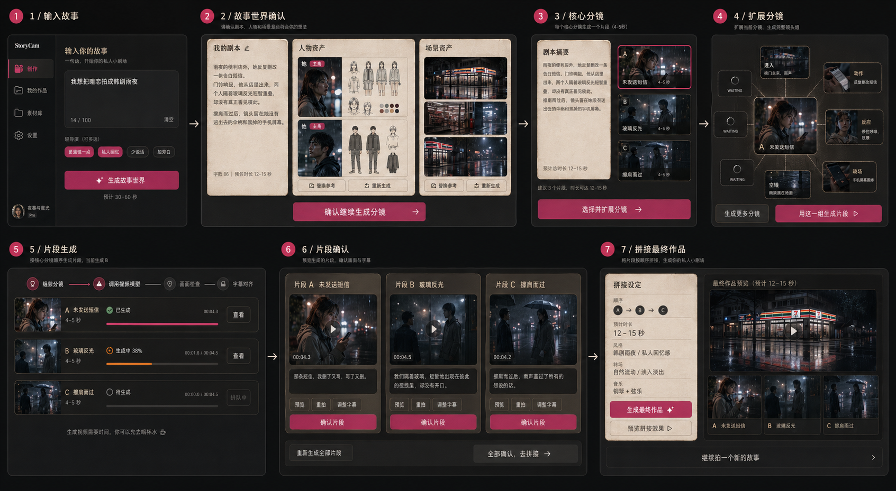

# StoryCam UI Design Brief

Date: 2026-04-25  
Use: 给设计师做第一版 Web 原型和 UI 图的唯一设计输入

## UI 参考图

当前生成的顺序交互画板：



## 设计目标

StoryCam 是一个 Web 端私人小剧场相机。用户输入一句私人念头后，产品不是直接给一个黑盒视频结果，而是让用户看见故事被拍出来的过程：

```text
输入一句话
  -> 生成剧本、人物资产、场景资产
  -> 用户确认
  -> 生成 1-3 个核心分镜图
  -> 点击某个核心分镜，向四周扩展分镜图
  -> 每个核心分镜组生成一个视频片段
  -> 用户确认片段
  -> 系统建议拼接成最终作品
```

## 必须表达的核心交互

一张 UI 图需要同时表达这些关键交互，不需要把每个页面都单独展开成完整系统：

1. **输入区**  
   用户输入：“我想把暗恋拍成韩剧雨夜”。旁边有轻导演选项，例如“更遗憾一点 / 像私人回忆 / 少说话 / 加旁白”。

2. **剧本和资产确认区**  
   用户输入后，先看到“我的剧本”、人物资产、场景资产。人物资产包含角色图和设定稿；场景资产包含场景参考图。这里的按钮是“确认继续生成分镜”。

3. **核心分镜区**  
   MVP 默认生成 1 个核心分镜组，例如“未发送短信”。这个核心组代表一个 15 秒视频片段。

4. **分镜扩展画布**  
   用户点击一个核心分镜后，中心是当前核心分镜图，四周生成扩展分镜卡。部分卡片显示 waiting/loading。扩展卡可以是“进入 / 动作 / 反应 / 空镜 / 转场 / 续写”。主按钮是“用这一组生成片段”。

5. **片段生成和确认区**  
   选中的核心分镜组生成一个 15 秒短视频片段。用户看到单个可播放片段，可以确认生成最终作品或重拍。

6. **最终拼接建议区**  
   系统把已确认片段渲染成账号内私有最终作品，展示真实预览和文件状态。

## 页面形态

第一版是 **桌面 Web 产品**，不是移动端 App。

建议画成一个完整工作台界面：

- 左侧：输入和轻导演。
- 中央：当前主画布，重点展示“核心分镜扩展画布”。
- 右侧：剧本摘要、资产确认、片段状态和下一步动作。
- 底部：1-3 个视频片段的时间线，以及最终拼接建议。

这张 UI 图可以像一个“正在创作中的产品截图”，不需要是营销页。

## 视觉方向

关键词：

- 私人
- 电影感
- 小剧场
- 温暖但不俗气
- 有生成过程感
- 像私人记忆的导演工作台

建议：

- 使用深色工作台背景，配合暖色纸张/胶片质感卡片。
- 关键按钮可以使用高饱和粉色或红色，但不要整页紫蓝渐变。
- 分镜图要有真实画面感，不要只是空白占位。
- 资产卡、分镜卡、片段卡要能一眼看出层级关系。
- UI 要像真实产品，不要像概念海报。

## 文案语气

使用普通用户能懂的说法：

- 生成故事世界
- 我的剧本
- 人物资产
- 场景资产
- 确认继续生成分镜
- 这一段会这样拍
- 用这一组生成片段
- 重拍这一段
- 拼成最终作品
- 继续拍

不要在主界面出现：

- 九列分镜
- Prompt Packet
- 模型调用
- Seedance reference packet
- shot group orchestration

## 产品约束

- MVP 默认 1-3 个核心分镜组。
- 每个核心分镜组生成一个视频片段。
- 扩展出来的分镜图默认只是该片段的生成指导，不代表额外视频调用。
- 最终作品目标是 10-15 秒。
- 视频生成必须是真实结果，不是只生成脚本或图片。

## 本次 UI 图应包含的示例内容

固定输入：

> 我想把暗恋拍成韩剧雨夜

剧本摘要：

> 雨夜的便利店外，她反复删改一条告白短信。门铃响起，他从店里出来，两个人隔着玻璃反光短暂重叠，却没有真正看见彼此。擦肩而过后，镜头留在她没有递出去的伞柄和黑掉的手机屏幕。

核心分镜：

1. 未发送短信
2. 玻璃反光
3. 擦肩而过

片段：

- 片段 A：未发送短信，4-5 秒
- 片段 B：玻璃反光，4-5 秒
- 片段 C：擦肩而过，4-5 秒

最终拼接：

- 顺序：A -> B -> C
- 时长：12-15 秒
- 风格：韩剧雨夜，私人回忆感

## 设计验收标准

看这张 UI 图时，用户应该能立刻理解：

- 输入一句话后，系统先生成故事世界。
- 用户确认剧本、人物和场景后，才进入分镜。
- 核心分镜不是装饰图，而是视频片段的单位。
- 点击核心分镜可以向四周扩展更多分镜。
- 片段确认后，系统会建议拼成最终作品。
